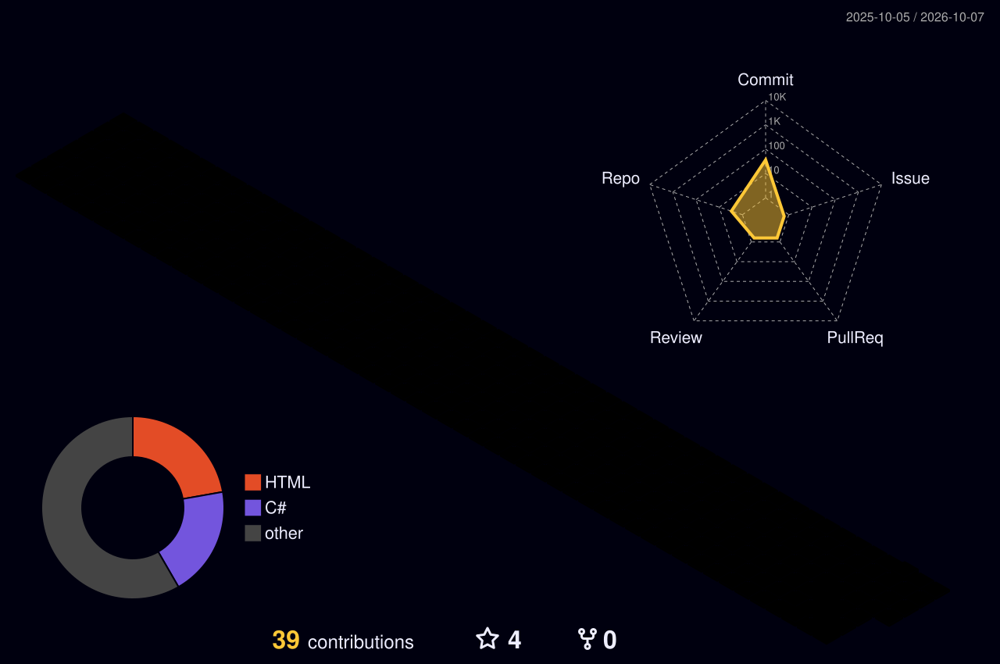

# Hi there, I'm Shahd 👋

**Final Year Computer Science Student**
**Specializing in:** Machine Learning | Software Engineering | Problem Solving  

---

### Tech Stack & Skills

- **Languages:** C++, Python, C#, JavaScript, TypeScript, SQL
- **Frameworks & Web:** .NET / ASP.NET Core, React, Node.js, Tailwind CSS
- **AI & Data Science:** TensorFlow, Scikit-Learn, Pandas, NumPy
- **Engineering Tools:** Git & GitHub, PlantUML, Jira, System Architecture

---

### Featured Projects

- **Tech Job & Skill Matching System:** AI-powered matching platform built using React, Node.js, & Machine Learning models.
- **Skill Exchange System:** Web platform designed with C# & .NET for peer-to-peer skill sharing.
- **Competitive Programming:** Optimized C++ solutions for problems on Codeforces & LeetCode.

---

### 📬 Connect with me

### Tech Stack

### Languages & Frameworks

### 🤖 AI & Data Science

### Tools & Technologies

## 📊 GitHub Stats

  
  

  

